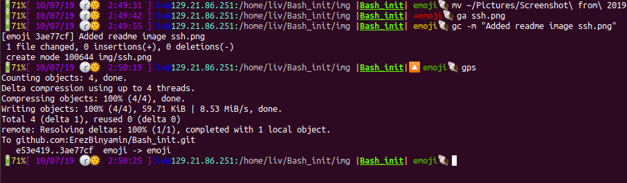
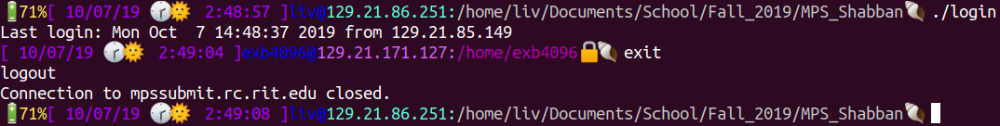
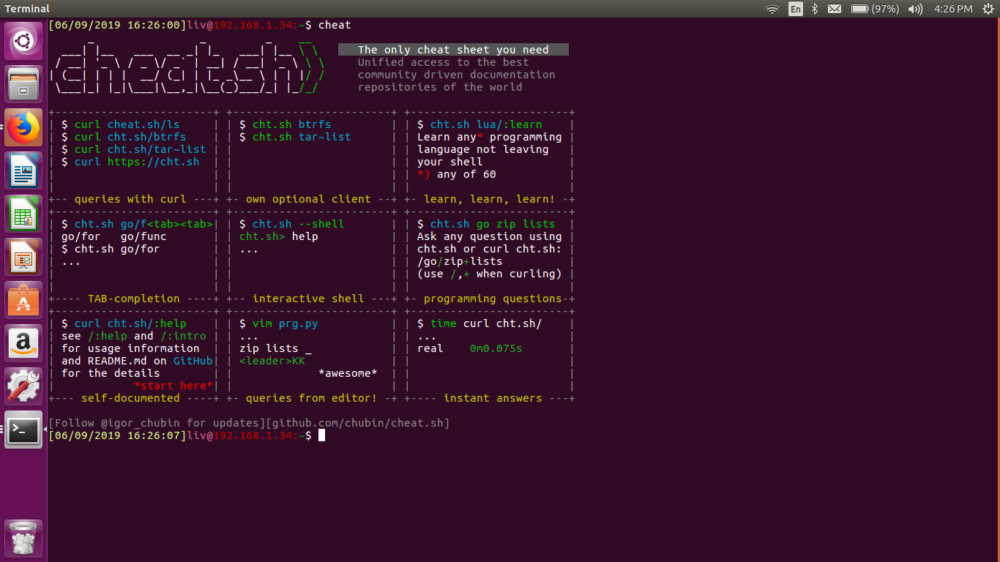

# Erez's bashrc stuff

These are some scripts that make my bash terminal a fun place to be!

## Getting Started

Just clone this repo and direct your bashrc source these files

### Samlpe Installation

Do these commands, then you'll be good

```bash
cd
git clone https://github.com/ErezBinyamin/Bash_init.git
printf '
INIT_DIR=/home/$USER/Bash_init
if [ -d ${INIT_DIR} ]; then
    for f in $(ls ${INIT_DIR}/*.sh)
    do
        source $f
    done
fi
' >> /home/$USER/.bashrc
source /home/$USER/.bashrc

```

# Example features

## Git command line



## Battery life


## SSH awareness



## Cheat.sh

