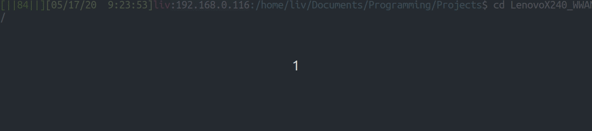

# Erez's bashrc stuff

These are some scripts that make my bash terminal a fun place to be!

## Getting Started

Just clone this repo and direct your bashrc to source some scripts

### Sample Installation

Do these commands, then you'll be good

```bash
git clone --recursive https://github.com/ErezBinyamin/dotfiles.git

[ -f ~/.bashrc ] && cp ~/.bashrc ~/.bashrc.bak

printf "
# Dotfiles: https://github.com/ErezBinyamin/dotfiles.git
DOTFILES=${PWD}/dotfiles"'
[ -d ${DOTFILES} ] && source ${DOTFILES}/top.sh || echo "[ERROR] DirectoryNotFound: ${DOTFILES}"
' >> ~/.bashrc

source ~/.bashrc
```

# Example features
To learn about more capabilities of this fun repo, use the command:
```
erez
```

## Toggle command line features
```bash
PS1
```
Command line components can be toggled **ON**/**OFF** to simplify work enviroment. Working Directory component resizes from full path to just current directory to allow for at least **20 chars** of free space. Default component options are set in this [config file](prompt/config.sh)


## Git command line
Autodetect git repository. Show repo name (in unique random color) and current branch name/status.

#### Git status symbols
> ```-``` removed a file  
> ```+``` added   a file  
> ```*``` edited  a file  
> ```^``` need to push  
> ```@``` in .git directory  

## Battery life
Battery life that goes from Green -> yellow -> orange -> red -> blinking red


## SSH awareness
Prompt is either a shell or a secure shell  


# TODO
* [X] Update gifs/images
* [X] Change ```prompt``` commad to ```PS1``` it'd be a coool gimmick
* [X] Automatically shorten prompt based upon ```tput cols```  
* [X] Create single script that when sourced delivers enviroment. (No for loop in ```.bashrc```)
* [X] Installer script with dependencies
* [X] Allow configuration of prompt symbols in global config file (outside of [prompt](prompt/) dir)
* [ ] Allow configuration of commands (eg ```${BROWSER}``` instead of using ```firefox```) 
* [ ] Do not store information in enviroment variables. Use some other method.
* [ ] Maintain _emoji_ branch somehow
