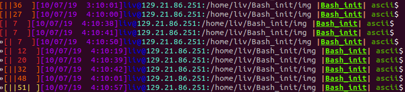
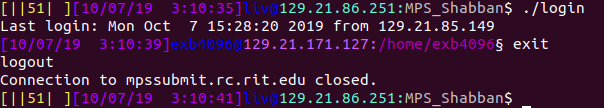

# Erez's bashrc stuff

These are some scripts that make my bash terminal a fun place to be!

## Getting Started

Just clone this repo and direct your bashrc to source some scripts

### Samlpe Installation

Do these commands, then you'll be good

```bash
cd
git clone https://github.com/ErezBinyamin/Bash_init.git
printf '
INIT_DIR=/home/$USER/Bash_init
if [ -d ${INIT_DIR} ]; then
    for f in $(ls ${INIT_DIR}/*.sh)
    do
        source $f
    done
fi
' >> /home/$USER/.bashrc
source /home/$USER/.bashrc

```

# Example features
To learn about more capabilities of this fun repo, use the command:
```
erez
```

## Toggle command line features
```bash
prompt
```
Default feature options are set in this [config file](prompt/config.sh)


## Git command line
Autodetect git repository. Show repo name (in unique random color) and current branch name/status.

#### Git status symbols
> ```-``` removed a file  
> ```+``` added   a file  
> ```*``` edited  a file  
> ```^``` need to push  
> ```@``` in .git directory  

## Battery life
Battery life that goes from Green -> yellow -> orange -> red -> blinking red


## SSH awareness
Prompt is either a shell or a secure shell  


# TODO
* [ ] Allow configuration of commands (eg ```${BROWSER}``` instead of using ```firefox```) 
* [ ] Installer script with dependencies
* [ ] Automatically shorten prompt based upon ```tput cols```  
* [ ] Maintain _ascii_ branch somehow
